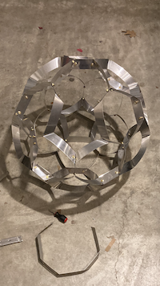
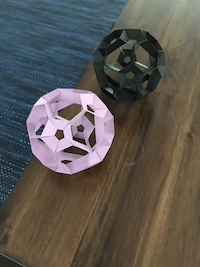
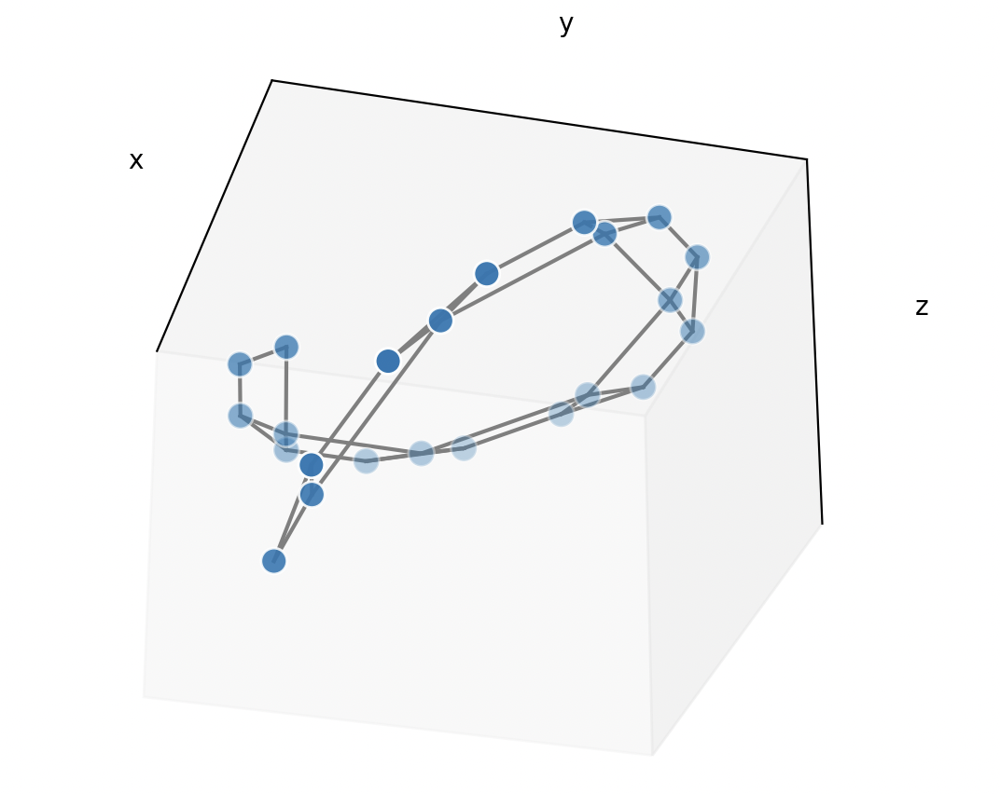

# Dihedral angles experiment

This is an ongoing project in identifying and rendering interesting symmetries of regular 2-D shapes in three dimensions.

The "legacy" folder contains the early attempts to produce these outputs by hard-coding different forms I had produced using physical models.

The "optimization" folder is designed to run as a high-throughput computing job capable of identifying these symmetries more or less autonomously. The "animations" folder renders these visually.

## Background 
This project started in 2020, as an origami experiment of sorts. Working with a truncated tetrahedron, I found that cross-sections taken in parallel with its hexagonal faces up to the peak of the adjoining triangular facets could be "unfolded" into flat strips of alternating triangles and trapezoids. I used this to build physical models, in the form of spheres, by taking advantage of the fact that truncated tetrahedra *almost* tesselate in three dimensions, and that sheet metal and paper are flexible :)

*A nice rendering of this at*: [RobertLovesPi](https://robertlovespi.net/2014/05/28/seventeen-truncated-tetrahedra-in-symmetrical-formation/)

*My models*:

I then started experimenting in the other direction, trying to fold flat shapes into regular, three-dimensional forms. I had seen something like this when I was trawling through Renaissance geometry -- Durer had a pattern in a notebook of a sprawling set of pentagons that could be cut out and folded into a dodecahedron. What I found was a little weirder than that, and I haven't been able to find anything quite like it.

I found, first empirically with paper models, then through computational optimization, that a dodecagon

* with a hexagon cut out of the middle such that
* the remaining ring was again an alternating series of triangles and trapezoids
* and that this ring could be folded
	* into three-dimensional shapes
	* along the ring's inner edges that the triangles & trapezoids shared
	* always at the same angle but in different directions
* these shapes were odd-looking
* but precisely aligned various vertices & faces of the two-dimensional ring
* and the angle at which it was to be folded looked a lot like the dihedral angle of a tetrahedron (was based on the arccos of the square root of 3)
	
So, in other words, I sort of lucked out. My manipulations of a 12-sided polygon was acting a lot like truncated tetrahedron's strips. However, all of the above took me a bit over a year of pecking away in my spare time.

The regularity of the solution led me to try out the same method on a decagon: cut out a pentagon, and see if folding along the resulting ring's inner edges, might align the form's vertices, edges, and faces in three dimensions. It did with a paper model, my computational model identified the optimal folding angle out to several decimal places, and the exact angle was listed on [this nice menu of dihedral angles for regular polyhedra](https://en.wikipedia.org/wiki/Table_of_polyhedron_dihedral_angles).

In May 2023 I decided to dust this project off and start testing this "method" on even-sided polygons.

## Current state

As of June 10, 2023

### Method

There are 2**(N-1) ways of folding any of these given rings.

I am using Networkx in Python to hold the state of the different vertices, their connections to one another, and their relative positions in the ring, because the folds must be performed in order.

#### 1. Sweeping the shapes

First, we find the optimal folding angle for an N-gon. The HTC slurm script in the optimization folder is currently being kicked off like this:

	sbatch --array=0-24 scavenger.slurm 14 50

Where:

* array identifies the number of parallel tasks that will be run
	* always start at 0
	* in the above example, we're running 25 tasks
* arg 2 identifies the number of sides
	* it must be even
	* here, we are considering a 14-sided shape
* arg 3 identifies the sampling rate of folding angles
	* we begin at -pi/2 and go to pi/2
	* Here, we would test 48 angles in between

Each task gets an even slice of the 2(**N-2) different ways of folding the shape, and begins walking through these, folding it from -pi/2 to pi/2 degrees, and logging when nodes appear to be approaching one another.

The test for that is:

* set a threshold for "closeness"
	* relative to the shape's size
	* which is given by the radius of the circle we used to draw the N-gon
* at each step
	* evaluate all different nodes' euclidean distances
	* catch all pairs that fall below the closeness threshold
* use that subset of close neighborings
	* and calculate a "closeness of close neighborings" average
	* along with which nodes are close neighbors in this configuration
* Those are all saved to json files in optimizer/outputs/N.json

The system is currently identifying good hits, from what I can see -- both in terms of the folding angles, which show up consistently in different foldings of the shape, and in the folding patterns, which look good when rendered visually.

Current issues:

* My computational method is suboptimal
	* I'm using networkx, but have a lot of annoying/lazy scaffolding around it
	* And networkx necessitates some truly annoying workarounds
	* Perhaps this should be done in numpy instead, or alongside, for accuracy
* Refactor needed
	* There's a lot of duplicative code and poorly-used packages
* Accuracy & automation
	* I'm not *fully* there on autonomously
		* determining the optimal folding angles & patterns
		* ranking these 

#### 2. Animating the matches/hits

Currently, there's a hard break between that sweep on the one hand and my visual inspection of the outputs. I export the list of candidate matches after a run, and then render them in the animations folder.

I name a particular folding output. To stick with the previous example, we pull the 5990th folding pattern (as indexed in the binary linspace of length 2**(N-1)) for the 14-gon with:

	python3 main.py 14_5990.json 10
	
Where the integer at the end tells you the number of frames we'll produce in our animation (this isn't 100% accurate -- I actually reverse the frames & tack those on at the end, so that you get a smooth folding/unfolding animation). Our output filenames from this step look like:
	
	14_5990_-1.3143397836447095_10_-6396997197626572266.json

Where the underscore-joined numbers represent, in order:

* N
* The number of the folding pattern, indexed in the 2**(N-2) binary linspace
* Folded from zero to -1.314... radians
* In 10 steps
* Finally, a hash of a concatenated string of the nearest neighbor vertex labels

I'm hoping to be able to integrate this fairly well, with all those indices, into a Flask app for exploratory visual analysis.

#### 3. Missing middle steps

What I need now is to have the system act a little more intelligently.

* When an angle keeps showing up as a good match on a given N-gon
	* The system should attempt to
		* Optimize on that angle
		* for a single given folding pattern with a lot of hits
	* Or I just need a good kickoff script to handle this semi-manually
	* I need some visualization of the optimal angles across n-gons
* Once those angles are locked in to 5-ish decimal places
	* I need another sweep workflow
	* Where I begin to walk across all folding patterns
	* And come up with a way of ranking "good" matches
	* So I can have a principle for deciding what to animate (because it's expensive)

But what does that last one look like? Some combination of the number of close neighbors and the closeness of those neighbors, I'd think. Except that I don't want to rule out, especially in larger shapes, the possibility of very long unspoolings that connect in only a few places but in interesting ways.

What, then, is interesting??